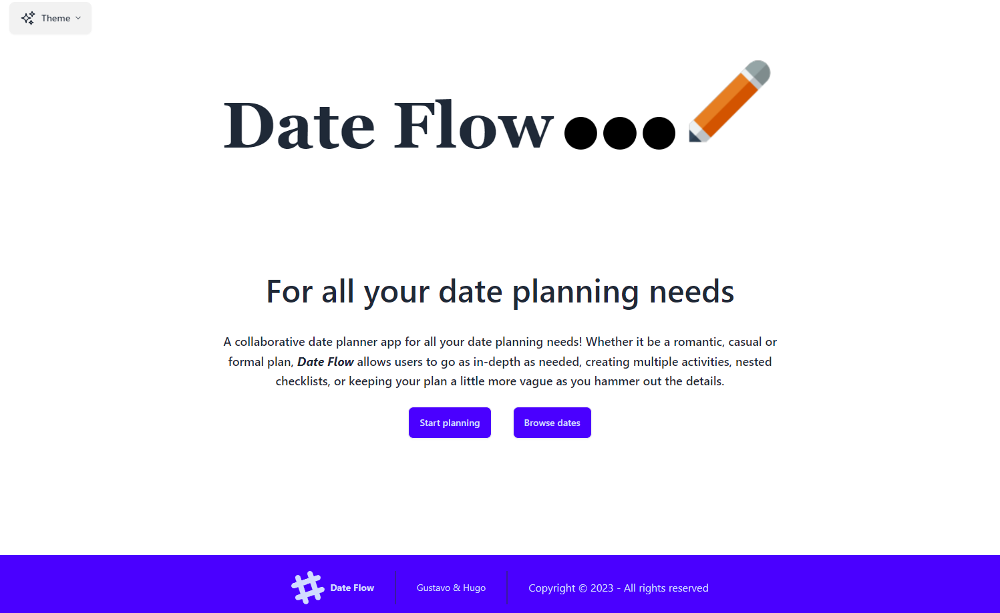

# Date planner App : **Date Flow**

[Click here](https://dateflow.netlify.app/) to test the app.

## Description

A collaborative date planner app for all your date planning needs!
Whether it be a romantic, casual or formal plan, **Date Flow** allows users to go as in-depth as needed, creating multiple activities, nested checklists, or keeping your plan a little more vague as you hammer out the details.

## I. Objective

- Create a small fullstack app in JS with CRUD
- Second project during the Ironhack Bootcamp

### II. Integrations

Interation with Google Maps API to display locations and use search functionalities.

### III. Constraints

- Duo project, collaboration, managing merge conflicts
- Time restraint: the app had to be produced in less than a week
- Technologies: Javascript with React, Vite, Node.js and Tailwind CSS

### IV. Instructions to run this app in your computer

- Install the dependencies with `npm install`
- Create an `.env` file and add those environment variables : `VITE_API_URL="https://date-flow.adaptable.app"`
- To fully use the app, you'll need to :
1. Have an Google API key in order to communicate with Google Maps API. You can follow steps on the Google documentation (https://developers.google.com/maps/get-started)
2. In GoogleMapsScriptLoader.jsx, you can now replace the API key variable by your API key

- Run the app with `npm run dev`
